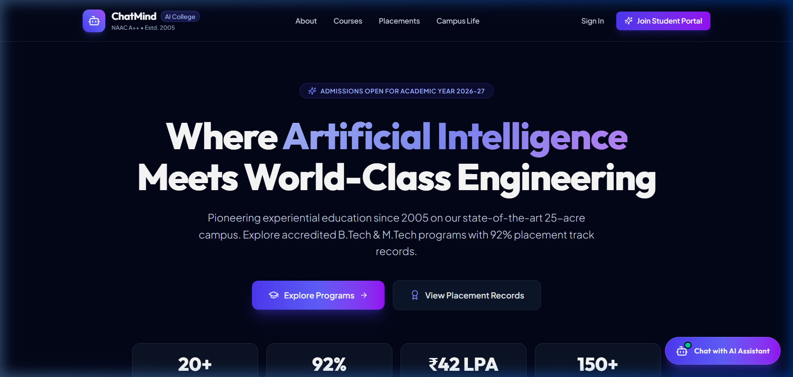
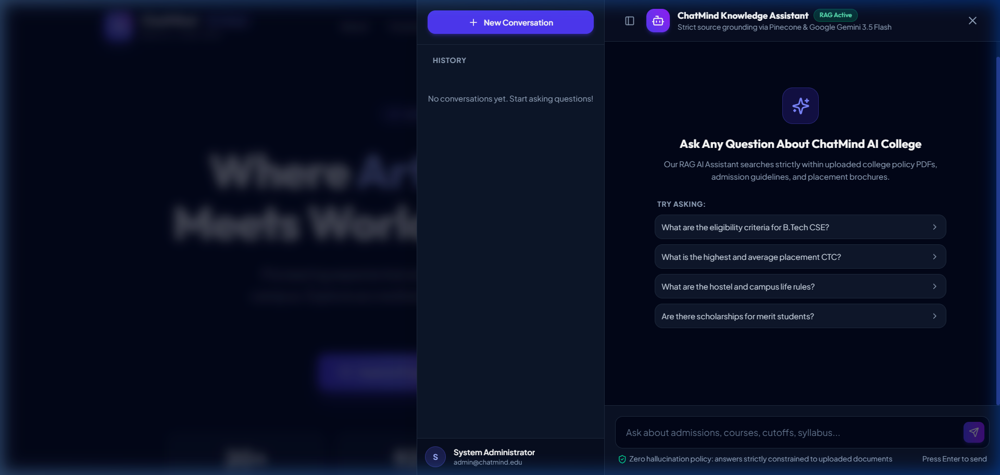
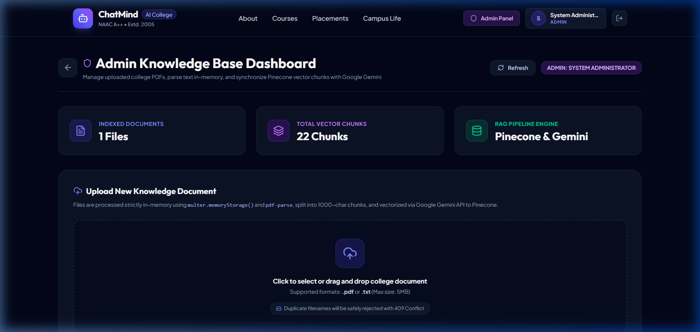
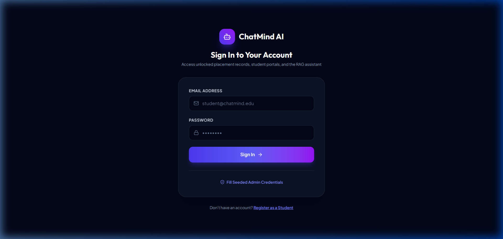

# 1. Project Name

**ChatMind AI College — Full-Stack RAG-Based Assistant & Student Portal**

> An intelligent academic portal and zero-hallucination knowledge assistant built with **React 19**, **Vite**, **Tailwind CSS v4**, **Node.js/Express (TypeScript)**, **MongoDB Atlas**, **Pinecone**, and **Google Gemini API (`gemini-3.5-flash` & `gemini-embedding-001`)**.

---

# 2. Problem Statement

Navigating college portals to find critical information—such as admission cutoffs, fee structures, hostel rules, scholarship criteria, placement statistics, and examination schedules—is often frustrating and time-consuming. Information is typically scattered across dozens of unorganized PDF notices and static web pages. Furthermore, standard AI chatbots hallucinate inaccurate information, which can mislead prospective and enrolled students.

**ChatMind AI College** solves this problem by providing:
1. **Zero-Hallucination Retrieval-Augmented Generation (RAG)**: Uses Pinecone vector database and Google Gemini to provide factual answers strictly grounded in official college documents with verifiable source badge citations (`Source: [filename]`).
2. **Gated Campus Portal**: Offers visitors comprehensive institutional details, while providing authenticated students unlocked placement records and personalized multi-session chat.
3. **In-Memory Admin Knowledge Management**: Enables college administrators to upload `.pdf` and `.txt` documents that are parsed, chunked, and vectorized on-the-fly without persistent filesystem clutter, complete with cascading vector deletion.

---

# 3. Features

### ⭐ Core / Must-Have Features
- **Interactive Chat Interface**: Floating, multi-session RAG AI Chat Drawer with suggested query prompts, active session history, and real-time response generation.
- **User Authentication**: Secure JWT-based authentication (7-day tokens), password hashing with bcrypt (10 rounds), and route protection.
- **In-Memory Document Upload & Processing**: Fast `.pdf` / `.txt` parsing via `multer.memoryStorage()` and `pdf-parse`, chunked cleanly using LangChain `RecursiveCharacterTextSplitter` (1000 characters, 200 overlap).
- **Embeddings & Vector Database**: 768-dimensional vector generation using Google Gemini `gemini-embedding-001` and storage in Pinecone serverless vector index.
- **Grounded RAG Pipeline**: Queries vector index for top-3 most similar chunks (`topK: 3`) and provides grounded context to Google Gemini `gemini-3.5-flash`.
- **Source/Reference Display**: Returns unique source filenames displayed as clickable pill badges beneath every AI answer.
- **Unknown Question Handling**: Strict system prompt constraints outputting *"Relevant information is unavailable in the current knowledge base."* when context is missing.
- **Multi-Session Chat History**: Preserves chat sessions and message logs in MongoDB.
- **Admin Document Management**: Dashboard to view indexed document counts, chunk totals, and trigger cascading document & vector deletion.

### 🚀 Bonus Features
- **Admin Knowledge Base Dashboard**: Dedicated portal for administrators with real-time vector chunk counters and upload dropzones.
- **Role-Based Access Control (RBAC)**: Distinct permissions for `student` and `admin` roles, enforced via backend `requireAdmin` middleware.
- **Brute-Force Rate Limiting**: `express-rate-limit` restricting auth endpoints (`/api/auth`) to 5 requests per minute.
- **Gated Teaser & Scroll Popup**: Teaser section on landing page prompting login for placement data, plus a 50% scroll-triggered student registration modal.
- **MongoDB Fail-Safe Resilience**: Backend gracefully catches database downtime with timeout handling, allowing health and operational checks to stay responsive.

---

# 4. Technology Stack

| Layer | Technologies Used |
|---|---|
| **Frontend** | React 19, Vite, React Router DOM v7, Tailwind CSS v4, Zustand, Axios, Lucide React, React Hot Toast |
| **Backend** | Node.js (v20+ / v24+), Express.js, TypeScript (Strict Mode) |
| **Database** | MongoDB Atlas (Mongoose ODM) |
| **Vector Database** | Pinecone Vector Database (`@pinecone-database/pinecone`) |
| **AI & Embeddings** | Google Gemini API (`gemini-3.5-flash` for chat, `gemini-embedding-001` for embeddings) via `@google/generative-ai` |
| **RAG Orchestration** | LangChain.js text splitting (`@langchain/textsplitters`), Pinecone client, Gemini SDK |
| **File Processing** | `multer` (`multer.memoryStorage()`), `pdf-parse` (In-memory text extraction) |
| **Security & Utilities** | JSON Web Tokens (`jsonwebtoken`), `bcryptjs`, `express-rate-limit`, `helmet`, `cors`, `dotenv` |

---

# 5. Screenshots

### Home Landing Page


---

### Active RAG Knowledge Assistant Chat Drawer


---

### Admin Knowledge Base Dashboard


---

### Student Sign-In / Login Page


---

# 6. Live Demo

- **Frontend Application (Vercel)**: [https://chat-mind-ai.vercel.app/](https://chat-mind-ai.vercel.app/)

---

# 7. Backend

- **Backend API (Render)**: [https://chatmind-ai.onrender.com/](https://chatmind-ai.onrender.com/)
- **API Health Check**: `GET https://chatmind-ai.onrender.com/api/health`

---

# 8. Setup Instructions

### Prerequisites
- **Node.js** (v20.x or v24.x recommended)
- **MongoDB** (Local instance or MongoDB Atlas cluster connection string)
- **Pinecone Account** (API Key and 768-dimension Index)
- **Google AI Studio API Key** (Gemini API access)

---

### Step 1: Clone Repository
```bash
git clone https://github.com/GarvitSid/ChatMind-AI.git
cd chatmind-college
```

---

### Step 2: Backend Setup & Installation

1. Navigate to the backend directory:
   ```bash
   cd backend
   ```
2. Install dependencies:
   ```bash
   npm install
   ```
3. Create your environment configuration file:
   ```bash
   cp .env.example .env
   ```
4. Seed the initial Administrator Account:
   ```bash
   npm run seed:admin
   ```
   *(Creates `admin@chatmind.edu` / `Admin@123`)*
5. Start the backend development server:
   ```bash
   npm run dev
   ```
   *(Server starts on `http://localhost:5000`)*

---

### Step 3: Frontend Setup & Installation

1. Open a new terminal and navigate to the frontend directory:
   ```bash
   cd frontend
   ```
2. Install dependencies:
   ```bash
   npm install
   ```
3. Start the Vite development server:
   ```bash
   npm run dev
   ```
4. Open your browser and visit:
   ```
   http://localhost:5173
   ```

---

# 9. Environment Variables

The application requires the following environment variables configured in `backend/.env` and `frontend/.env`:

### Backend Environment Variables (`backend/.env`)

| Variable Name | Description | Example / Default Value |
|---|---|---|
| `PORT` | Port number for Express server | `5000` |
| `MONGO_URI` | MongoDB connection URI string | `mongodb://localhost:27017/chatmind_college` |
| `JWT_SECRET` | Secret key for signing JSON Web Tokens | `your_jwt_secret_key` |
| `GEMINI_API_KEY` | Google Gemini API Key | `your_gemini_api_key` |
| `PINECONE_API_KEY` | Pinecone Vector Database API Key | `your_pinecone_api_key` |
| `PINECONE_INDEX_NAME` | Name of the Pinecone 768-dimension index | `chatmind-college` |
| `CLIENT_URL` | Allowed origin for CORS | `http://localhost:5173` |

### Frontend Environment Variables (`frontend/.env`)

| Variable Name | Description | Example / Default Value |
|---|---|---|
| `VITE_API_URL` | Base API URL pointing to the backend | `http://localhost:5000/api` |

> ⚠️ **Important**: Never commit actual API keys, database credentials, or secret keys to version control. Keep `.env` files added to `.gitignore`.
